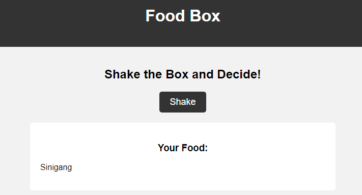

# Food Box - Random Food Selector

Food Box is a web application that helps you decide what to eat by randomly selecting a famous food from the Philippines based on different categories. Whether you're in the mood for fast food, desserts, famous restaurant dishes, or street food, Food Box has got you covered.

## Features

- Shake the Food Box to randomize the selection
- Select different categories to narrow down your food options
- Discover a variety of famous foods from the Philippines
- Fun and interactive way to decide your next meal

## Technologies Used

- HTML
- CSS
- JavaScript

## Getting Started

1. Clone the repository: `git clone https://github.com/your-username/food-box.git`
2. Open the `index.html` file in your web browser.
3. Shake the Food Box to see your random food selection!

## Contributing

Contributions are welcome! If you have any suggestions, improvements, or new features you'd like to see added, feel free to open an issue or submit a pull request.

## License

This project is licensed under the [MIT License](LICENSE).

Enjoy exploring the vibrant and diverse culinary culture of the Philippines with Food Box. Shake, select, and enjoy a delicious surprise!

